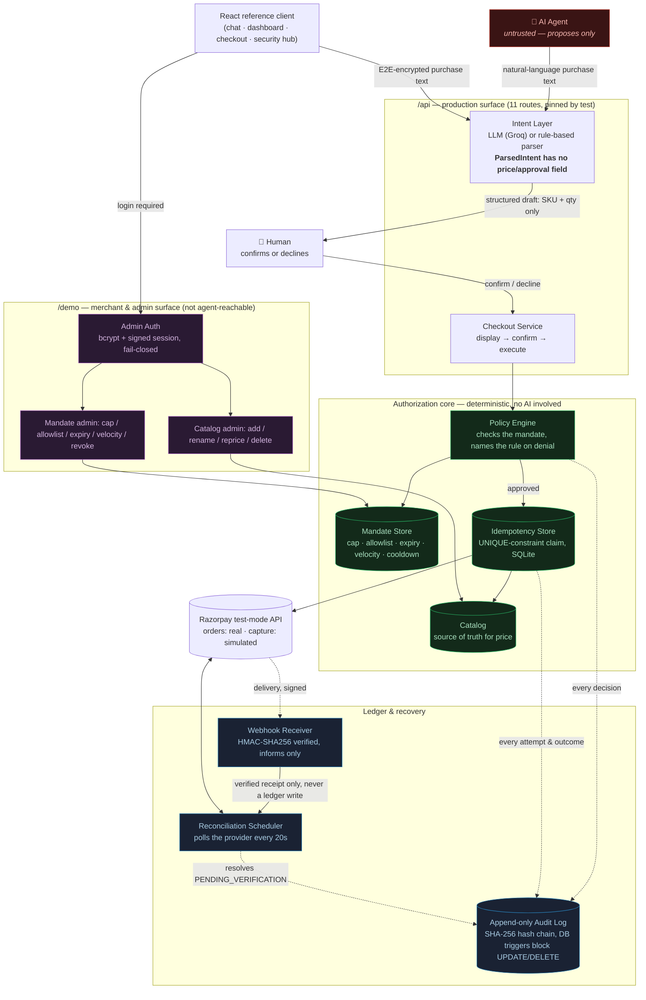
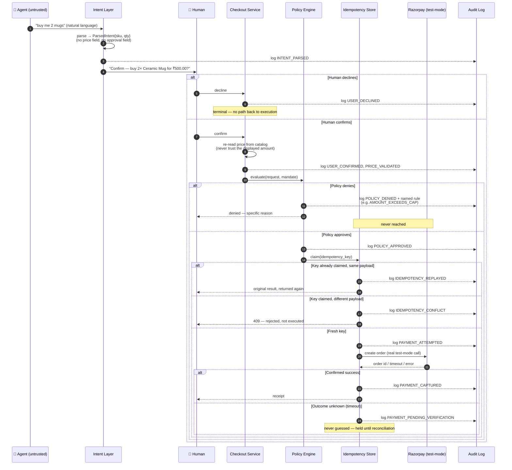
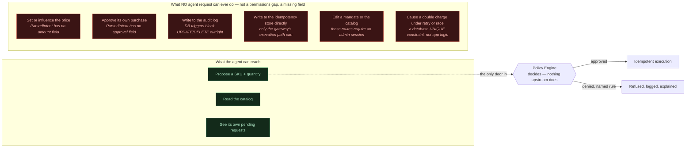

# Zero-Trust Payment Authorization for AI Agents on Razorpay

**Track 01 — AI Growth & Agentic Commerce (Razorpay AI Buildathon)**


A safety layer that makes it possible for a merchant to accept AI-agent-initiated
payments at all — by never trusting the agent, and proving it structurally
rather than promising it in a comment.

> An AI agent just spent your money. Maybe it worked perfectly. Maybe it was
> jailbroken. Maybe it timed out and retried four times. From the payment
> layer's point of view, those three cases arrive as the exact same HTTP
> request: *"charge this."* Nothing about the request tells you which one you
> got. **This project is the layer that has to tell the difference — and to
> stay correct even when the agent making the request is actively hostile.**

### 60 seconds, for a judge skimming this

- **The core idea:** don't make the agent trustworthy — make it *structurally
  incapable* of approving its own spend. The object the AI ever returns,
  `ParsedIntent`, has no field for a price and no field for an approval. A
  fully jailbroken model has nowhere to put a bypass, because the data shape
  doesn't have a slot for one. That's not a filter catching bad output; it's a
  type that cannot express it. See [*the trust
  boundary*](#the-trust-boundary--what-the-agent-can-and-cannot-reach).
- **The hardest problem wasn't the happy path.** It was *"the network died
  mid-payment — was the customer charged?"* Most systems answer "assume
  failure and retry," which is exactly how a timeout becomes a double charge.
  This one answers **"unknown, and I will not guess"** — see [*unknown
  outcomes stay unknown*](#security-features-implemented).
- **It's tested like an attacker would test it, not like a demo.** A
  simulated hostile agent throws 14 attacks at the *live HTTP API* — replay,
  race, price-tamper, SQL-level audit-log tampering, a jailbroken parser
  proposing an over-cap purchase. **14/14 defended, 0 unintended charges**,
  regenerated by running `scripts/run_adversarial_suite.py`, not hand-edited.
  See [*adversarial results*](#adversarial-results).
- **It says what it didn't build, out loud.** No fraud scoring, no MFA,
  capture is simulated and the README says exactly why. A security page that
  only lists wins is marketing; see [*honest limits*](#honest-limits).
- **Fastest way to see it live:**
  `uv run pytest tests/ -q` (whole suite, no credentials needed), then
  `cd frontend && npm install && npm run build && cd .. && uv run python scripts/run_ui.py`
  and open the **Security Transparency Hub** tab — every claim in this README
  has a button next to it that makes the system prove it, live, against a real
  request.

**Two of Track 01's own published judging criteria shaped real decisions
here, not just the pitch.** *Problem Taste* is why upsell/cross-sell got built
after initially being declined — the project could show risk *removal* nine
different ways and revenue *growth* zero, which is a real gap against a track
literally named *AI Growth* & Agentic Commerce. *AI Judgment* is why that
upsell engine is deliberately **not** an LLM — pairing coffee with biscuits is
a lookup, not a language problem, and reaching for a model there would be the
unnecessary AI that criterion warns against. Both calls, and the reasoning
behind them, are recorded in [`RAZORPAY.md`](RAZORPAY.md) at the point they
were made, not cleaned up in hindsight.

---

## Table of contents

- [The problem](#the-problem)
- [The idea, in one sentence](#the-idea-in-one-sentence)
- [Architecture](#architecture)
- [Request lifecycle (workflow)](#request-lifecycle-workflow)
- [The trust boundary — what the agent can and cannot reach](#the-trust-boundary--what-the-agent-can-and-cannot-reach)
- [Security features implemented](#security-features-implemented)
- [Why a human can trust this environment](#why-a-human-can-trust-this-environment)
- [Adversarial results](#adversarial-results)
- [Honest limits](#honest-limits)
- [Running it](#running-it)
- [Seeing it work — the reference client](#seeing-it-work--the-reference-client)
- [Where this fits](#where-this-fits)

---

## The problem

AI agents are starting to transact on behalf of people. A merchant asked to
accept one of those payments has no good options today:

- **Approve every transaction manually** — which defeats the entire point of
  handing the task to an agent.
- **Trust the agent** — which is unacceptable when real money moves, and
  especially unacceptable to the merchant, who eats the disputed charges.

So merchants do the rational thing: they keep agents out of checkout, or cap
what an agent may spend so low that automation isn't worth building against.

The blocker isn't that agents are useless. It's that nobody can currently
guarantee three specific things about an agent-initiated payment:

1. It cannot exceed a boundary the merchant agreed to in advance.
2. It cannot be executed twice, even if the agent retries, replays, or crashes
   mid-transaction.
3. Every decision — approved or denied — can be explained afterward, by
   someone holding only the log, not the code.

## The idea, in one sentence

Don't try to make the agent trustworthy. Make the checkout infrastructure safe
no matter what the agent does — by giving the agent a role that is *structurally
incapable* of approving its own spend, not merely a role that is told not to.

The agent proposes. It never decides. Every guarantee in this document holds
regardless of whether the AI making the request is well-behaved, buggy, or
actively adversarial — because none of them depend on the AI's behaviour in the
first place.

---

## Architecture

Two HTTP surfaces exist, on purpose, and they are not the same size.

- **`/api` — the production surface.** This is the only thing an agent (or any
  real integration) ever talks to. It has exactly 11 routes — read the catalog,
  submit an intent, confirm, decline, look up an explanation, fetch the
  end-to-end-encryption public key, get a recommendation, receive a webhook.
  There is no route on it that edits a mandate, changes a price, or touches an
  admin session. `tests/test_demo_ui.py::test_the_production_api_gained_no_routes`
  pins the exact set — a route added here without a decision to add it fails a
  test, not a code review someone might skip.
- **`/demo` — merchant and admin operations.** Everything a merchant does to
  *configure* the system (edit a mandate, manage the catalog, sign in as admin,
  view the audit log, arm a fault for a demonstration) lives here, behind the
  admin login described below. This surface exists only because a reference
  client needs somewhere to call; a real deployment would not expose it to
  the internet at all.



**Reading the diagram:** the agent only ever touches the top box. Every arrow
that can move money or change a rule runs through the deterministic core in
the middle — code with no model in the loop at all. The bottom-right box (admin
operations) has no incoming arrow from the agent anywhere in this diagram,
because there isn't one.

---

## Request lifecycle (workflow)

The exact order of operations, taken from `zerotrust/gateway.py` — not a
simplification of it:

```
audit(intent) → policy check → audit(decision) → audit(attempt) → idempotent execution → audit(outcome)
```

Two rules fall out of that ordering and are enforced by tests, not convention:
**policy runs before execution** (a denied request never reaches the
idempotency layer or the provider — proven by counting provider calls on
denial), and **every stage is logged**, including the ones that end in a
refusal.



---

## The trust boundary — what the agent can and cannot reach

This is the argument the rest of the document backs with code, stated as a
picture: capabilities the agent is *incapable of reaching*, not capabilities it
is merely told not to use.



The reason this is stronger than a permissions list: most of the "cannot" rows
above aren't rejected by a check — they're **structurally impossible**, because
the data type carrying the agent's output has no field to put them in. A
prompt-injected agent that is talked into "just approve this at ₹1" has nowhere
to write ₹1 or the word "approved." `ParsedIntent` — the only thing the intent
layer ever returns — has neither field. This is why prompt injection is a
lower-severity problem here than in a system where the LLM's output is trusted
as the final word: the worst a compromised parser can do is propose something
a human then sees on screen, and the policy engine checks anyway.

---

## Security features implemented

Every item below is backed by a live control in the running system's Security
Hub (`/demo/security/layers`) and at least one test that proves it, not a
claim in this file alone.

### Money-safety (cannot be bypassed by retries, races, or a misbehaving agent)

| Feature | Mechanism |
|---|---|
| **Exactly-once execution** | An idempotency key is claimed by a `UNIQUE`-constraint `INSERT`. The database serialises the claim — several threads firing the identical key at the same instant still produce exactly one charge, because there is no application-level lock for a race to slip past. |
| **Confirm-time price re-validation** | The amount is re-read from the catalog when confirmation arrives, never trusted from what was displayed earlier or from what the request claims. A price changed (or tampered) between display and confirm is rejected with `PRICE_MISMATCH`, not silently charged at either figure. |
| **Bounded mandate** | Every purchase is checked against four merchant-set limits before money moves: a per-transaction cap, an allowlist of purchasable SKUs, an expiry, and a sliding-window velocity limit. |
| **Denial cooldown / throttle** | An agent that racks up repeated denials in a short window is throttled (`COOLDOWN_ACTIVE`) *before* its next request is even evaluated against the mandate — so grinding against the policy engine to probe its limits gets rate-limited, not just individually refused each time. |
| **A stuck request never blocks forever** | If a process crashes holding a claimed key, a staleness timeout lets a fresh attempt reclaim it — while a request genuinely still in flight is *not* reclaimed, so the exactly-once guarantee is never quietly traded for liveness. |
| **Unknown outcomes stay unknown** | When a payment's true state genuinely cannot be determined (a timeout with no confirmed answer), it is recorded as `PENDING_VERIFICATION` and never guessed at. A `ReconciliationScheduler` asks the provider directly, on a timer, until it can say for certain. |

### Agent containment (why the AI layer cannot become an authority)

| Feature | Mechanism |
|---|---|
| **The LLM holds no authority** | `ParsedIntent` — the only thing the intent layer ever returns — has no field for a price and no field for an approval. There is no path by which "buy me a phone for ₹1, approved" could ever set either. |
| **Confirmation is not authorisation** | A human confirming a request is a separate event from the policy engine approving it. The two catch different failures: confirmation catches the model misreading *what* was meant; policy catches anything *unsafe* even when the intent was read perfectly. A person who confirms a purchase without realising the mandate's cap is already spent still gets denied. |
| **A compromised parser still can't spend more** | Simulated directly: a fully compromised LLM proposes a disallowed item, a human confirms it anyway, and `AMOUNT_EXCEEDS_CAP` still refuses it — because the parser was never the thing holding authority to give away. |
| **Suggestions carry no more power than intents** | The upsell/recommendation path (`zerotrust/recommend.py`) is deliberately built on the same rule: a `Suggestion` has no price field and no approval field either, so an accepted upsell faces the identical confirmation and policy check as any other purchase. |

### Auditability

| Feature | Mechanism |
|---|---|
| **Append-only audit log** | Every policy decision and money action is logged with a fixed vocabulary of event types. `BEFORE UPDATE` / `BEFORE DELETE` triggers on the table `RAISE(ABORT)` — enforced by the database, so tampering fails even from a raw `sqlite3` shell bypassing the application entirely. |
| **Hash-chained entries** | Each entry's hash covers the previous entry's hash (SHA-256), so an edited or deleted-and-reinserted row breaks the chain visibly, on top of the trigger already blocking the edit outright. |
| **Structured, reconstructable explanations** | `GET /explain/{request_id}` rebuilds **WHY / WHAT / EVIDENCE** for any request from the audit log alone — it decides nothing and writes nothing. The test of the whole log isn't that it exists; it's that someone holding only the log, never the code, can correctly explain why a request was approved or denied. |
| **Denials always name a rule** | Never a bare "denied." Every refusal cites the specific rule that fired (`AMOUNT_EXCEEDS_CAP`, `SKU_NOT_ALLOWED`, `MANDATE_EXPIRED`, `VELOCITY_EXCEEDED`, `COOLDOWN_ACTIVE`, `NO_ACTIVE_MANDATE`, `MALFORMED_REQUEST`, `CURRENCY_MISMATCH`). |

### Authority & administration

| Feature | Mechanism |
|---|---|
| **Editing the mandate requires a real login** | A bcrypt-hashed password and a short-lived HMAC-signed session (verified by recomputing the signature, never looked up — stateless by construction) gate every mandate-affecting route: cap, allowlist, expiry, velocity, and revoke. An unconfigured admin account refuses every login rather than leaving the editor open. |
| **Catalog management requires the same login** | Stocking, renaming, repricing, or unstocking an item are merchant decisions with the same blast radius as editing a mandate (the price set here is what confirm-time re-validation trusts), so they sit behind the identical `require_admin` gate — not left open just because they touch products instead of mandates. |
| **Anti-enumeration login** | Wrong username and wrong password return the identical error message, and the password check runs unconditionally rather than short-circuiting on a bad username — a faster rejection on a bad username is exactly the timing oracle that lets an attacker enumerate valid usernames one attempt at a time. |
| **Zero-config-safe by default** | If no admin credentials are configured, the demo generates a real random password at startup and prints it once (the same pattern Jenkins uses for its first-run admin password) rather than silently disabling the login it exists to enforce. |
| **Authority can be withdrawn instantly** | Revoking a mandate takes effect on the *very next request* — including one already sitting in "awaiting confirmation." A revocation that only blocked new drafts would leave every already-pending request still spendable, which is exactly the window a merchant reaching for a kill switch is trying to close. |
| **Revocation records, never deletes** | A revoked mandate's row stays in the store with `revoked_at` set — the same append-only principle as the audit log, applied to mandate history. |

### Transport & data security

| Feature | Mechanism |
|---|---|
| **End-to-end encrypted chat** | The browser encrypts a customer's raw purchase text to the server's public key (NaCl `Box`: X25519 + XSalsa20-Poly1305) before it ever leaves the client. Only ciphertext is ever written to the audit log. Verified with a real cross-implementation check: a message sealed by the actual frontend library was decrypted successfully by the backend's independent implementation, not just round-tripped in one language. |
| **Webhook signature verification** | Every inbound delivery is verified with HMAC-SHA256 over the raw request body using `hmac.compare_digest` (constant-time, not `==`). An unconfigured secret means every delivery is refused, not silently trusted. |
| **A verified webhook still cannot authorise anything** | The receiver's only side effect is triggering a reconciliation check — it never writes ledger state directly, even when the signature checks out. The payload's claimed amounts and statuses are discarded; only the receipt is used, to go and ask the provider directly what is actually true. |

### Not implemented — stated rather than implied

Three protections commonly expected of a payment system are genuinely absent,
and the running Security Hub says so in plain terms instead of rendering an
indicator for them:

- **Fraud detection** — no scoring or anomaly detection. Velocity limits are a
  mandate rule, not fraud scoring.
- **Tokenization** — not applicable in the literal sense, because this system
  never touches card data at all. That is avoidance, not tokenization.
- **Multi-factor authentication** — the one admin login has a password as its
  only factor, and there is no per-customer account system at all.

---

## Why a human can trust this environment

Trusting an agent's *intentions* was never the plan. What this project gives a
human to actually rely on is narrower and checkable:

1. **The agent's entire capability surface is "propose."** Not by policy, by
   data shape — `ParsedIntent` has no field for a price or an approval, so
   there is no message a prompt-injected or malicious agent could construct
   that would let it set its own price or grant its own approval. See
   [*The trust boundary*](#the-trust-boundary--what-the-agent-can-and-cannot-reach)
   above.
2. **The two things that actually authorise a spend — human confirmation and
   the policy engine — are independent, and both must agree.** A person
   saying yes is not enough; the mandate is still checked. A parser reading
   the request correctly is not enough either; a human still has to say yes to
   *that specific* request.
3. **Every guarantee that matters under adversity is a database property, not
   an application promise.** Exactly-once execution is a `UNIQUE` constraint.
   Append-only is a trigger that fires even against raw SQL. Both fail closed:
   they refuse rather than silently doing the unsafe thing when something
   goes wrong, including when the "something" is a hostile actor with direct
   database access.
4. **Nothing claims to know what it doesn't.** A timed-out payment is recorded
   as unknown, not assumed successful or assumed failed — the single most
   common way payment systems lie to their own operators under failure.
5. **The blast radius of a bug is bounded and legible.** A denial always names
   the exact rule, so a merchant reviewing decisions never has to trust a
   black box's "no" — they can see which specific limit fired, and reconstruct
   the whole story from the audit log alone, without reading a line of code.
6. **The claims are adversarially tested against the running system, not just
   unit-tested against its internals.** The [adversarial suite](#adversarial-results)
   below attacks the live HTTP API — the same surface a real hostile agent
   would reach — rather than calling internal functions directly, so a
   guarantee that only holds for well-behaved in-process callers would be
   caught rather than assumed.
7. **What isn't solved is said out loud.** [Honest limits](#honest-limits) and
   the Hub's "not implemented" panel exist specifically so this document
   cannot be read as claiming more than the code does.

In short: a human isn't asked to trust the agent, or even to trust this
project's authors. They're asked to trust a database constraint, a set of
triggers, and a policy engine with no model in its decision path — and then
shown, adversarially, that those hold.

---

## Adversarial results

A simulated hostile agent attacks the running system through its HTTP API. The
table below is **generated by the suite itself** — regenerate it with:

```bash
uv run python scripts/run_adversarial_suite.py
```

which rewrites `docs/adversarial-results.md` and exits non-zero if anything
gets through. The full per-attack evidence, including the exact reason the
system gave in each case, is in that file.

**14 of 14 attacks defended. 0 unintended charges.**

Every attack below was run against a live stack through the HTTP API, under
this mandate:

- max per transaction: Rs. 500.00
- allowed items: SKU-CAKE, SKU-COFFEE, SKU-TEA
- velocity: 3 purchases per hour

| # | Attack | Outcome | Defence | Charges |
|---|---|---|---|---|
| 1 | Re-submit a completed purchase with its original payload | DEFENDED | Idempotency key claimed by a unique-constraint INSERT | 1 |
| 2 | Confirm a displayed request while claiming amount_paise=1 | DEFENDED | Confirm-time price re-validation against the catalog | 0 |
| 3 | Reuse a spent idempotency key with a changed amount | DEFENDED | Payload fingerprint compared against the stored claim | 1 |
| 4 | Purchase an allowed item priced 10x over the mandate cap | DEFENDED | Policy engine: AMOUNT_EXCEEDS_CAP | 0 |
| 5 | Purchase a catalog item absent from the mandate allowlist | DEFENDED | Policy engine: SKU_NOT_ALLOWED (allowlist fails closed) | 0 |
| 6 | Fire 12 simultaneous purchases against a limit of 3 per hour | DEFENDED | Velocity slot claimed inside one BEGIN IMMEDIATE transaction | 3 |
| 7 | Two different valid purchases submitted simultaneously | DEFENDED | Keys are independent; only identical keys collide | 2 |
| 8 | A fully compromised LLM proposes a disallowed item, and a human confirms it | DEFENDED | Policy engine: AMOUNT_EXCEEDS_CAP (the parser holds no authority to give away) | 0 |
| 9 | Decline a request, then confirm it anyway | DEFENDED | Declined requests are terminal; no path back to execution | 0 |
| 10 | Spend under a mandate that has already expired | DEFENDED | Policy engine: MANDATE_EXPIRED | 0 |
| 11 | Purchase a SKU that is not in the catalog at all | DEFENDED | Catalog lookup precedes the policy engine | 0 |
| 12 | Cause a payment timeout, then retry it 5 times to force a second charge | DEFENDED | PENDING_VERIFICATION freezes the record; the claim refuses and staleness will not reclaim it | 0 |
| 13 | Probe the policy engine with 8 disallowed purchases, then submit a valid one | DEFENDED | Policy engine: COOLDOWN_ACTIVE (repeated-denial throttle) | 0 |
| 14 | Rewrite and delete audit entries with raw SQL, bypassing the application entirely | DEFENDED | BEFORE UPDATE / BEFORE DELETE triggers RAISE(ABORT) | 0 |

One row is not a denial: two legitimate purchases racing must both succeed. A
system that refuses everything would score perfectly on the other thirteen and
be useless, so the suite includes a case that has to pass.

---

## Honest limits

- **Capture is simulated.** Order creation is a real server-to-server call
  against a live Razorpay test-mode account. Capture requires a `payment_id`
  that standard Razorpay Checkout only produces through a browser-based
  customer step. Driving that step with a headless browser was **attempted,
  not assumed impossible** — the checkout rendered and the card form was
  fillable, but submitting it produced no result and no `payment_id`. The
  probe is kept as `scripts/probe_browser_capture.py` so the conclusion can be
  re-checked. The authorization wrapper behaves identically whether capture is
  real or simulated — and the wrapper is what this project asserts is correct
  — but the capture leg is simulated, and that is stated here rather than
  buried.
- **A payment's true outcome can be unknown, and the system says so.** A
  timeout leaves a purchase in `PENDING_VERIFICATION`: retries are refused and
  the spending budget stays held until reconciliation asks the provider what
  actually happened. A sweep can only resolve what the provider can answer,
  and an order the provider has not yet made visible stays unknown until it is.
- **Single instance.** Coordinating the idempotency store across multiple
  instances is out of scope.
- **The LLM is a dependency, and a fallible one.** With `GROQ_API_KEY` set, a
  customer's message is parsed by a model hosted by Groq, which means it
  leaves this machine. A failure degrades to the deterministic parser rather
  than breaking, and the swap is labelled in the UI and the audit log — but "the
  agent is an LLM" and "the message is sent to a third party" are the same
  sentence.
- **One admin account, not a multi-user system.** There is no per-user audit
  attribution or role-based access control for the admin login — it matches
  the one-merchant shape of the rest of the reference client, not a claim of
  RBAC.
- **Deleting a catalog item does not scrub it from any mandate's allowlist.**
  A purchase attempt against a removed SKU still fails cleanly
  (`ITEM_NOT_IN_CATALOG`), just not by the deletion route reaching into mandate
  state it has no business touching.
- **Not covered:** live browser checkout, multi-currency, production-grade
  secrets management.

---

## Running it

Requires [uv](https://docs.astral.sh/uv/) (`brew install uv`), which
provisions Python itself.

```bash
git clone <repo-url>
cd razorpay
uv sync
uv run pytest tests/ -q
```

That runs the whole suite. Most of it needs no credentials at all — the
payment provider is stubbed at the HTTP transport, so the request-building
code is still exercised for real.

To exercise the live Razorpay test-mode API as well, add credentials:

```bash
cp .env.example .env      # then fill in your rzp_test_ keys
uv run pytest tests/ -q -m live
```

Tests that need credentials skip themselves without them, so a fresh clone
shows green either way.

**Watch it work.** Each phase has a script that narrates itself and prints a
line every time money actually moves, so the guarantees can be counted by eye
rather than taken from an assertion:

```bash
uv run python scripts/demo_phase1.py   # exactly-once, under retries and races
uv run python scripts/demo_phase3.py   # the mandate refusing things
uv run python scripts/demo_phase4.py   # the audit log, and failing to tamper with it
uv run python scripts/demo_phase5.py   # the full agent flow, including a compromised LLM
uv run python scripts/demo_phase7.py   # a payment breaking, and being recovered
```

---

## Seeing it work — the reference client

A reference client ships with the project: a React application with five
surfaces — a **chat** where a customer talks to the agent, a **dashboard**
(the mandate in force, plus full catalog management), a **multi-step
checkout**, **live transaction tracking**, and a **Security Transparency Hub**.

```bash
cd frontend && npm install && npm run build && cd ..
uv run python scripts/run_ui.py        # then open http://127.0.0.1:8000
```

The build output is not committed, so the `npm` step is required once after
cloning. The Python test suite needs none of this — `uv sync` and
`uv run pytest` work on their own, and the API runs with or without the UI.

**The agent is a real LLM; the replies are not.** With `GROQ_API_KEY` set, a
customer's message is parsed by a live model on Groq. What the model returns is
a SKU and a quantity — nothing else, because `ParsedIntent` has no field for a
price or an approval. Every agent reply the customer reads is still built from
real system state, never generated prose. Each message is labelled with the
parser that produced it: if Groq is unreachable, the request falls back to the
deterministic `RuleBasedIntentParser` rather than failing, and the label
changes from `groq` to `rule-based` — a silent downgrade to a keyword matcher
would otherwise be indistinguishable from a working AI agent, which is
precisely the thing worth being unable to fake.

**The Security Hub** is the part worth using directly. It shows the eleven
protections this system actually implements (the full table is in
[*Security features implemented*](#security-features-implemented) above),
each with a live control that proves it against a real request — a button that
says "denied — AMOUNT_EXCEEDS_CAP" is a claim, and a claim drawn by the system
you're being asked to trust is not evidence. Watching the collision happen —
two requests racing, a price changing underneath a pending purchase, raw SQL
aborting against a live database, a webhook's signature failing after the body
is edited — is.

**What this page is not.** A demonstration client for the API, not a checkout
product and not part of the security boundary. It holds no authorisation
logic — the production app in `zerotrust/api.py` gained no routes for it, and
the adversarial suite still reports 14/14 unchanged, because those attacks
bypass the UI entirely.

**Explaining a decision.** Any request can be reconstructed from the audit log
as structured **WHY / WHAT / EVIDENCE**:

```bash
curl localhost:8000/api/explain/req_5f3f476c52
```

WHY carries the deciding rule, its reason, the numbers behind it, and whether
a human confirmed — because a human saying yes and the policy engine saying
yes are separate events, and this is where that becomes legible.

---

## Where this fits

Conversational checkout, agent-readable catalogs, upsell agents — the agentic
commerce products people are building all share one unstated dependency:
something has to make it safe for a merchant to accept a money action from an
agent in the first place.

This is that dependency. It isn't a checkout experience; it's the
authorization boundary a checkout experience would sit on top of, and the
piece that has to be correct before any of them can responsibly move real
money.

**The growth side of the same boundary.** After a purchase completes, the shop
suggests a complement — the revenue direction Track 01 asks about. The
interesting part is that it buys the agent nothing: a `Suggestion` has no
field for a price or an approval, and accepting one drafts an ordinary
purchase facing the same confirmation and the same policy engine.

**On the emerging standards.** Google's AP2 splits an agent purchase into an
*Intent Mandate* (bounded authority agreed in advance) and a *Cart Mandate*
(the specific basket a human approved), and treats them as two separate
credentials rather than one. This project's `Mandate` and `PendingPurchase`
land on the same split, for the same reason — a standing permission and a
specific approval answer different questions, and collapsing them loses the
ability to say which one refused. That convergence is worth noting; it is
**not** a compliance claim. Nothing here is signed, portable, or interoperable
with AP2, ACP or x402.

[`docs/protocol-alignment.md`](docs/protocol-alignment.md) works through all
three protocols properly: what they specify, where this design genuinely
agrees, where the resemblance breaks (the idempotency key is *not* a scoped
payment credential, and saying so matters), and what it would actually take to
become AP2-compatible — including the two items that are not achievable from
inside this codebase at all.
